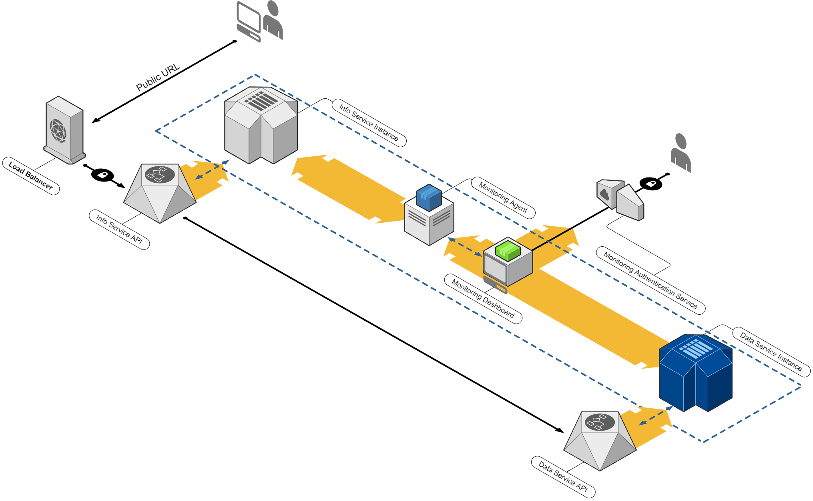

# SRE Playground
A list of Site Reliability Engineering challenges for beginners.

# Preface
The goal of this project is to introduce you to basic SRE topics. It was designed to give an overview covered by SRE during a whole life-cycle. If you have any questions or suggestions, please do not hesitate to contact me via:
* Email [ramiz.polic@hotmail.com](mailto:ramiz.polic@hotmail.com)
* Discord [fhivemind#3230](fhivemind#3230).

## Walkthrough
We will divide this challenge into multiple stages to ease out the whole process.     

## :thought_balloon: Design
Start by thinking how the whole infrastructure can be deployed, maintained, monitored, discarded, extended, or automated. Point of this step is to have a clearer picture on how to proceed, to rule out all the improbable scenarios and major blockers. In this case, try to answer some basic questions.   

*"Once you eliminate the impossible, whatever remains, no matter how improbable, must be the truth."* - Sherlock Holmes    

---

#### :grey_question: *What is the tech-stack?*
It will give you an idea what technologies you as an SRE should continue with. Remember, you are defining the way how the whole process is going to work. Hence, you need to decide the tools you are going to be working with.     

> **Example**      
 If you are buying IKEA furniture, what tools are you going to use for its assembly?

#### :grey_question: *How does it work?*
Get a nice overview of how the solution works. Usually, here you get a lot of graphs, or you need to create them. Graphs help you get a grasp of what is happening. Some services talk to each other, some are independent, some require more memory, some require a lot of computing power. Here you need information - well-defined and concise information. Without understanding what is happening, you cannot decide what you want to happen.     

> **Example**      
Once the IKEA furniture is there, which piece connects to which? Do I need help to lift the pieces, turn them, isolate them, protect them somehow?

     
#### :grey_question: *When, and how often?*
Here, you need to think in terms of how the whole solution is going to be updated, deleted, recreated, or moved. Most likely, you will have to implement some kind of automated mechanism on how to combat these issues. Notoriously, this is the moment when **Continuous Integration (CI)**, **Continuous Deployment (CD)**, **Anything-as-a-Code (XaaS)**  comes into the picture. They are not your enemy!     

> **Example**       
Okay, you have assembled your IKEA thing, but there's a piece you forgot to add. CI allows you to define a way on how to put this piece, or any other piece you might want to add on the needed place. On the other hand, CD allows you to define a way on how to put your IKEA thing to where you want it -- in the kitchen, living room, hanging from the ceiling, or spying on your neighbors (don't do this). However, you don't want to mess up the whole darn thing, but just a pieces of it. XaaS helps you with just that, isolate a component, and do something with it -- and only that.
     
     
     
#### :grey_question: *What if?*
If you want the solution to be bullet-proof, you have to take into account on how everything is going to behave once it's up and running. These are refereed as edge-cases, and a proper solution has to cover them. Your infrastructure is built to serve US West Coast under 100ms, but what do you do for connections from India? It's Black Friday, and suddenly you have 100x higher traffic than usual. Typically, this has to do something with auto-scaling, load balancing, or networking. Your task is now to think of any case impossible scenario in which you infrastructure will fail -- and extend to support it.    

> **Example #1**      
Your IKEA furniture is a chair. However, you have 10 guests, but only 4 chairs. It's illogical to buy 10 chairs if you have 10 friends coming over only couple of times a month. So, you go and ring your neighbor, asking him to borrow you some chairs, which you will obviously return (I mean, come on, who steals chairs?). You had a nice evening, and tomorrow you return these chairs.     

> **Example #2**       
Strangely enough, one of your friends requested to NOT sit on the chair, but instead on the floor. How can he see the top of the table, eat, drink, play, and socialize?

#### :grey_question: *What is happening?*
A question you will often ask throughout the whole process. Everything is now operational, you have come this far. But, one of the services is down (perhaps, a like button on Facebook is not counting likes properly), and you don't know what to do. Here, you need to setup the Monitoring, Logging, and Observability services. They help you troubleshoot and see what is happening in realtime. They spew out a lot of unnecessary things, so correctly configuring them will help you manage everything more easily.     

> **Example**      
Remember the IKEA furniture you got? Well, you've been using it for quite some time, and you see that some of the pieces are malfunctioning. Logically, you try to determine what's the cause. Hours on end, you figure out the glue is not properly applied. And, you reapply it.

#### :grey_question: *How good is all this?*
Whenever you're building something, you need to know how well it behaves. This part is focused on answering how your infrastructure is doing, health and functional -wise. It's commonly refereed as **Service Level Agreement (SLA)** which works based on **Service Level Indicators (SLI)**. They depict legal requirements and arrangements between a buyer, and the service seller.     

> **Example**       
Before you bought your IKEA furniture, they gave you a pamphlet. On it, you read that maximum weight your furniture can hold is 200kg, it can last for 10 years on specific condition, and is designed for a specific purpose. They also stated that if something is wrong or misleading, you can return it.

---

## :computer: Implementation
This part will define the overall architecture of the solution. Your task is to complete the challenges provided below based on the available information.

### Architecture overview

| Service | Model | Networking Type | Port | Paths | Response time | Dependencies | Extras
|---|---|---|---|---|---|---|---|
| **data** | container | Internal | 9876 | /api/* | < 1000ms | | |
| **info** | container | Internal | 5555 | /* | < 1000ms | data | | |
| **load balancer** | platform supported  | External | 80, 443 | / | | info | |
| **monitoring** | optional | | | | | | |

### Infrastructure specifications
Following the top-level definitions of the architecture, we also have to define how the infrastructure is going to be managed.     
| Service | Rate of change (per week) | Versioning (optional) | Details | Rollout strategy (optional) | Type
|---|---|---|---|---|---|
| **infrastructure** | 5 | Yes | | A/B Deployment | IaaC |
| **load balancer** | 1-2 | No | Should be part of infrastructure code, but supported separately.  | Big Bang Deployment | IaaC |
| **data** | > 50 | Yes | Storage must not be discarded. Keep logs. Enhance security rules. Reconfigure path rules before swapping with the old version. | Rolling Deployment | SaaC |
| **info** | > 50 | Yes | Must support high availability. | Rolling Deployment | SaaC |
| **monitoring** | 1-2 | Yes | Ensure firewall rules, authentication and authorization. Support only internal networks. | Rolling Deployment | SaaC |
We would also like to have a way of knowing when the deployments fail or succeed. Find a way to notify the users working on the project about the deployment statuses.

## :checkered_flag: Challenges
Before you start implementing, fork this repository.     

1) **Dockerization** - Write Dockerfiles for data and info services.
2) **Environment preparation** - Register a [Google Cloud Platform](https://cloud.google.com/free) free tier account, and create a GCP project.
3) **Docker configs** - Create a GCP service account that has read and write permissions to the Google Cloud Registry. Set Registry rules to private. Authenticate your service account against Docker.
4) **Basic CI** - Select an appropriate Continuous Integration tool for your project (refer to [Wiki:Comparison of continuous integration software](https://en.wikipedia.org/wiki/Comparison_of_continuous_integration_software) for more details). Your pipeline should be push triggered, and should only build docker images for data and info services. Leave some room for extending the pipeline.
5) **(optional) Pipeline as a Code** - Configure your Pipeline strategy to be code manageable. This step includes configuring the appropriate repo which will serve as a base for extending the pipeline. Reefer to [Pipeline as Code with Jenkins](https://jenkins.io/solutions/pipeline/) for details on how you can utilize Jenkins for this task.

### Code submission
:warning: When you want to submit your results, please make a merge request.

## :memo: Scoring

## Discussion
